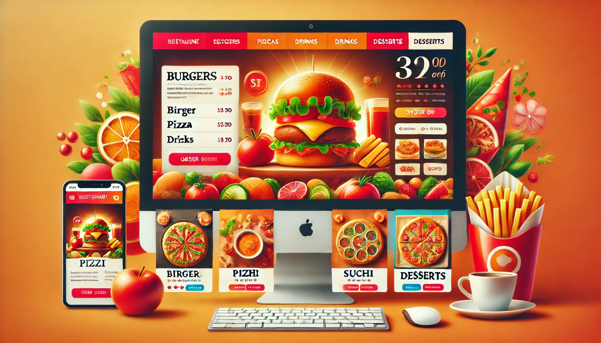

# Restaurant_E-Commerce_Website


[](https://developer.mozilla.org/en-US/docs/Web/Guide/HTML/HTML5)


 

## Project Overview

This project is a dynamic Restaurant E-commerce Website designed to facilitate online food ordering and delivery. It enables users to browse menus, select products, and purchase them through an integrated payment system. The website aims to provide a seamless, user-friendly experience that simplifies the ordering process while offering a variety of food options.





## Technologies Used

**React.js**: Utilized for building the user interface, ensuring a responsive, component-based structure that enhances user interaction and state management.

**Node.js**: Powers the backend, handling requests, server-side logic, and integration with database solutions.

**Express.js**: A web application framework for Node.js, used to build web services and APIs.

**MongoDB**: Employed as the database to store and manage user data, orders, and product information in a NoSQL format, which allows flexibility and scalability.

**CSS and Styled Components**: For styling, ensuring the application is visually appealing and functional on various devices.

## Features

### User Account Management

**Implementation**: Users can create, edit, and delete their accounts. Authentication is managed via secure login systems.

**Tools & Technologies**: React for the frontend, Node.js for server-side account management, and MongoDB for storing user credentials.

### Food Ordering System

**Implementation**: Features a dynamic menu from which users can select dishes. Incorporates a cart system for order accumulation and modifications.

**Tools & Technologies**: React components for menu and cart, Node.js for order processing, and MongoDB for order data persistence.

### Payment Integration

**Implementation**: Integrates with payment gateways like Stripe or PayPal for processing payments securely.

**Tools & Technologies**: Uses secure APIs for payment transactions, ensuring data integrity and security.

### Order Tracking

**Implementation**: Allows users to track their order status from preparation to delivery.

**Tools & Technologies**: Utilizes real-time data updates with web sockets or polling in Node.js.

### Responsive Design

**Implementation**: The website is fully responsive, ensuring it is accessible on both desktops and mobile devices.

**Tools & Technologies**: CSS Grid, Flexbox, and media queries via Styled Components.


## Available Scripts

In the project directory, you can run:

```
npm start
```

Runs the app in the development mode.\
Open [http://localhost:3000](http://localhost:3000) to view it in your browser.

The page will reload when you make changes.\
You may also see any lint errors in the console.


```
npm test
```

Launches the test runner in the interactive watch mode.\
See the section about [running tests](https://facebook.github.io/create-react-app/docs/running-tests) for more information.


```
npm run build
```

Builds the app for production to the `build` folder.\
It correctly bundles React in production mode and optimizes the build for the best performance.

The build is minified and the filenames include the hashes.\
Your app is ready to be deployed!

See the section about [deployment](https://facebook.github.io/create-react-app/docs/deployment) for more information.


## Conclusion
The Restaurant E-commerce Website is a comprehensive solution designed to enhance the dining experience by facilitating easy online ordering. By leveraging modern web technologies, the website ensures scalability, security, and an intuitive user interface, making it an ideal platform for restaurant owners looking to expand their reach online. Future enhancements could include AI-driven recommendations, loyalty programs, and more interactive elements to increase user engagement.